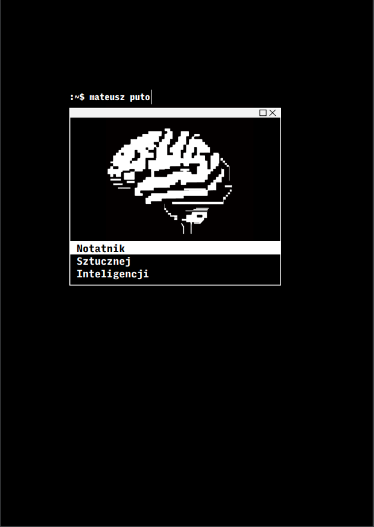

# dl_book

*Książka która przybliża głębokie uczenie oraz ogólnie opisuje pewne techniki, pomysły, zastosowania ale także anegdoty związane ze sztuczną inteligenicją. Pisząc ją chciałem aby była ona przystępna dla jak największej grupy odbiorców i mam nadzieję, że w osiągnąłem to przynajmniej w pewnym stopniu. Nie jest to jednak literatura, gdzie nie wyjaśnia się pewnych opisywanych tematów. Staram się aby czytelnik zrozumiał każde opisywane rozwiązanie. Z tego powodu tekst jest nieco wybiórczy, ale mam nadzieję że przypadnie do gustu osobom z mniejszą jak i większą wiedzą.*

### Spis treści

#### Wstęp  
 1.1 Cele...  
 1.2 ... i jak je osiągnąć  
 1.3 Właściwy wstęp  
 1.4 Jakie tematy poruszymy w tym kursie  
#### Optymalizacja matematyczna  
 2.1 Metoda prób i błędów  
 2.2 Wspinaczka górska  
 2.3 Metoda gradientu prostego  
 2.4 Plus wielkość kroku  
 2.5 Plus momentum  
 2.6 SGD  
#### Sieci neuronowe   
 3.1 Perceptron  
 3.2 Neurony  
 3.3 Funkcje aktywacji  
 3.4 Wszystko razem  
 3.5 Propagacja wsteczna  
 3.6 Zaawansowane tematy w zagadnienu  
#### Symboliczne AI  
 4.1 Rozwiązywanie poprzez wyszukiwanie  
 4.2 Drzewa poszukiwań  
 4.3 Poszukiwanie na głębokość i rozpiętość  
 4.4 Minimax   
 4.5 A*  
 4.6 MCTS  
#### Uczenie ze wzmocnieniem  
 5.1 Problem uczenia ze wzmocnieniem  
 5.2 Wieloręczny bandyta  
 5.3 MDP   
 5.4 Uczenie Monte-Carlo  
 5.5 Uczenie TD  
 5.6 Uczenie TD(lambda)  
#### Gry i więcej  
 6.1 AlphaGo (rok 2016)  
 6.2 AlphaZero (rok 2017)  
 6.3 MuZero (rok 2019)  
 6.4 AGI  
